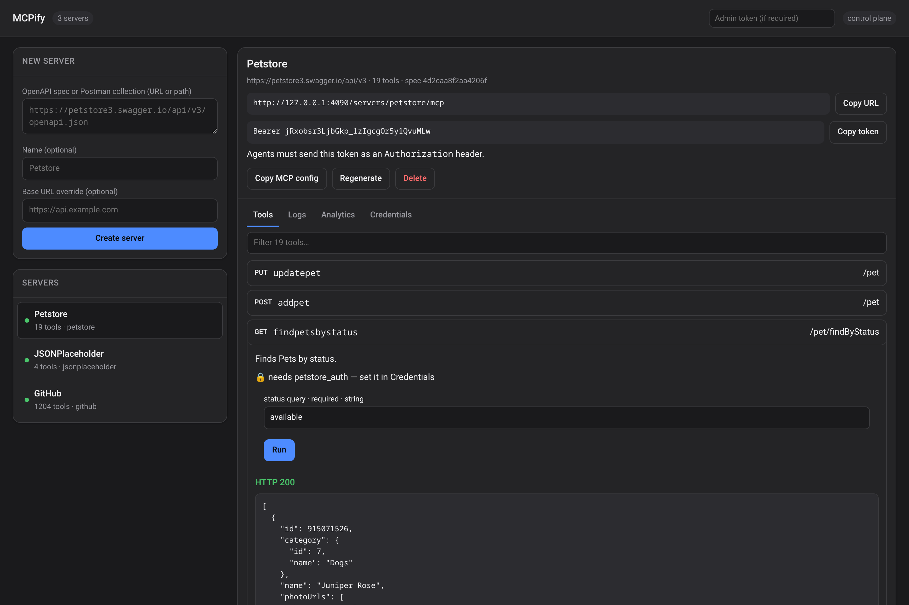

<p align="center">
  
</p>

<p align="center">
  <a href="https://github.com/asgerami/wrangl/actions/workflows/ci.yml"></a>
  
  = 22" />
  
</p>

<p align="center"><b>Your AI agent can't use your APIs. Wrangl fixes that in one command.</b></p>

AI agents like Claude and Cursor speak [MCP](https://modelcontextprotocol.io),
but almost every SaaS tool only speaks REST. Wrangl bridges the two. Point it at
any API and it generates a fully working MCP server: every endpoint becomes a
tool the agent can call, with your credentials injected server-side so they are
never exposed to the agent.

No OpenAPI knowledge, no config files, no boilerplate.

<p align="center">
  
</p>

## Quick start

Requires **Node 22+**.

```bash
# Point at an API. Wrangl finds the spec, generates the tools, and wires it
# into Claude Desktop. Restart Claude and it can use the API.
npx @asgerami/wrangl install https://petstore3.swagger.io

# No spec handy? Pick a ready-made one from the catalog.
npx @asgerami/wrangl add github --include "repos*"   # filter a huge API
npx @asgerami/wrangl add stripe                      # 587 tools
npx @asgerami/wrangl catalog                         # see them all

# Prefer a UI? A dashboard to create, test, and monitor servers.
npx @asgerami/wrangl serve             # http://localhost:4000
```

Target Cursor instead with `--client cursor`.

From source (or before the package is on your npm registry):

```bash
git clone https://github.com/asgerami/wrangl.git && cd wrangl
npm install && npm run build
node dist/cli.js install https://petstore3.swagger.io
```

## Why Wrangl

- **One command to a working tool.** `npx @asgerami/wrangl install <api>`
  discovers the spec, generates the tools, and writes the server into your agent
  client. Done.
- **A catalog of ready-made servers.** `wrangl add github|stripe|openai|twilio`
  so you don't need a spec at all.
- **Auto-discovery.** Point at a bare base URL and Wrangl probes well-known paths
  and even reads the docs page to find the OpenAPI spec.
- **Works with real APIs.** OpenAPI 3.x and Postman collections, tricky
  `style`/`explode` params, relative server URLs, and huge specs — use
  `--include` / `--exclude` to keep agent tool lists focused.
- **Auth handled.** Bearer, Basic, API key, OAuth2 (authorization-code + PKCE,
  client_credentials), and OpenID Connect discovery. Credentials stay
  server-side.
- **A real dashboard.** Create servers, run any tool interactively, browse
  request/response logs, and view per-tool analytics.
- **Production-ready.** Docker image, per-server tokens and rate limits, admin
  auth, and a Postgres backend for running multiple replicas.

## How it works

```
Any REST API ->  Ingest  ->  Generate  ->  MCP Runtime  ->  Your agent
 (spec / URL /   (parse +    (endpoints    (proxy calls     (Claude,
  Postman /       normalize)  to tools)     + auth inject)   Cursor...)
  auto-discover)
```

Ingest a spec (or discover it), map every operation to an MCP tool, then run a
server that proxies real calls to the upstream API with auth injected. That is
it, and it scales from a single stdio server up to a hosted multi-tenant control
plane.

## Documentation

The full reference lives in **[docs/GUIDE.md](docs/GUIDE.md)**:

- Every CLI command and flag
- Semantic enrichment, auto-discovery, live spec sync, usage logs
- The hosted control plane, dashboard, and REST API
- Authentication and the OAuth2 flow
- Securing and deploying (Docker, TLS, Postgres for multiple replicas)
- Library usage and project layout

## Development

```bash
npm run typecheck    # tsc --noEmit
npm test             # unit, live-network, and end-to-end MCP tests
npm run build        # emit dist/

WRANGL_SKIP_NETWORK=1 npm test   # skip tests that hit the public internet
```

## License

MIT
