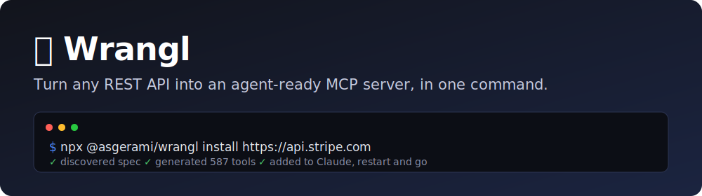

<p align="center">
  
</p>

<p align="center">
  <a href="https://github.com/asgerami/mcpify/actions/workflows/ci.yml"></a>
  
  
  
</p>

<p align="center"><b>Your AI agent can't use your APIs. MCPify fixes that in one command.</b></p>

AI agents (Claude, Cursor, …) speak [MCP](https://modelcontextprotocol.io), but
almost every SaaS tool only speaks REST. MCPify bridges the two: point it at any
API and it generates a fully-working MCP server — every endpoint becomes a tool
the agent can call, with your credentials injected server-side so they're never
exposed to the agent.

```bash
# Point at an API — MCPify finds the spec, generates the tools, and wires it
# straight into Claude Desktop. Restart Claude and it can use the API.
npx mcpify install https://petstore3.swagger.io

# Don't have a spec handy? Pick a ready-made one from the catalog:
npx mcpify add github        # 1,204 tools
npx mcpify add stripe        # 587 tools
npx mcpify catalog           # see them all
```

That's it — no OpenAPI knowledge, no config files, no boilerplate. Prefer a UI?
`mcpify serve` gives you a dashboard to create servers, **run any tool
interactively**, browse call logs, and see per-server analytics.

## How it works

```
Any REST API ─▶ Ingest ─▶ Generate ─▶ MCP Runtime ─▶ Your agent
 (spec/URL/     (parse +   (endpoints    (proxy calls    (Claude,
  Postman/       normalize) → MCP tools)  + auth inject)   Cursor…)
  auto-discover)
```

- **Ingestion** (`src/parser`) — loads an **OpenAPI 3.x** spec (URL or file,
  JSON/YAML) or a **Postman collection** (v2.x), normalizes both to canonical
  OpenAPI form, dereferences `$ref`s, and resolves the upstream base URL.
- **Generation** (`src/generator`) — deterministically maps each
  `(path, method)` operation to an MCP tool: input schema from OpenAPI
  parameters + request body, and an **outputSchema** from the success-response
  schema. _(The semantic LLM-enrichment pass that rewrites raw names into
  agent-friendly descriptions slots in here.)_
- **Runtime** (`src/runtime`) — a single dynamic server that loads any generated
  spec and exposes its tools over **stdio** or **Streamable HTTP**. On each tool
  call it builds the upstream request — serializing array/object parameters per
  their OpenAPI `style`/`explode` — injects auth, proxies it, and returns the
  response as text plus validated `structuredContent`.

Tested against large real-world specs (the full GitHub REST API, Petstore) to
keep ingestion and schema generation robust.

## What you get

- **One-command setup** — `mcpify install <api>` discovers the spec, generates
  the tools, and wires the server into your agent client (Claude Desktop /
  Cursor). No config files.
- **A catalog** of ready-made servers (`mcpify add github|stripe|openai|…`) so
  you don't need a spec at all.
- **Auto-discovery** — point at a bare base URL; MCPify probes well-known paths
  and even sniffs the docs page to find the OpenAPI spec.
- **Works with real specs** — OpenAPI 3.x, Postman collections, `style`/`explode`
  params, relative server URLs, and huge specs (the full 1,204-tool GitHub API).
- **Auth handled** — Bearer, Basic, API key, and full **OAuth2** (PKCE,
  encrypted tokens, auto-refresh). Credentials stay server-side.
- **A real dashboard** (`mcpify serve`) — create servers, **run tools
  interactively**, browse request/response logs, and view per-tool analytics.
- **Production-ready** — Docker image, per-server rate limits + tokens, admin
  auth, and a **Postgres** backend for running multiple replicas.

## Quick start

Requires **Node 22+** (uses the built-in `node:sqlite`).

```bash
# The fast path — API → agent tool, one command (auto-wires Claude Desktop):
npx mcpify install https://petstore3.swagger.io
npx mcpify add petstore           # …or from the catalog (no key needed)
npx mcpify install <api> --client cursor   # target Cursor instead

# The dashboard — create/test/monitor servers in a browser:
npx mcpify serve                  # → http://localhost:4000

# From source:
npm install
npm run dev -- inspect  --spec examples/jsonplaceholder.yaml   # see the tools
npm run dev -- catalog                                         # list ready-made servers
```

### CLI

```
mcpify install <api> [options]     # discover → generate → wire into your agent client
  -c, --client <name>     Agent client to configure: claude | cursor (default claude)
  -n, --name <name>       Name for the server in the client config
  --config <path>         Write to a specific MCP config file instead
  --print                 Print the config block instead of writing it

mcpify add <id>                    # install a ready-made server from the catalog
mcpify catalog                     # list the ready-made servers

mcpify generate --spec <url|file> [options]

  -s, --spec <source>     OpenAPI 3.x spec or Postman collection: a URL or file
  -d, --discover <url>    Auto-discover the spec by probing a base URL
  -b, --base-url <url>    Upstream base URL (overrides the spec's `servers`)
  -t, --transport <type>  stdio | http              (default: stdio)
  -p, --port <number>     Port for the http transport (default: 3000)
  -a, --auth <scheme=value>   Inject a credential for a security scheme (repeatable)
  -e, --enrich            Run the LLM semantic-enrichment pass (needs ANTHROPIC_API_KEY)
  -m, --model <id>        Claude model for enrichment (default: claude-opus-4-8)
  --effort <level>        Enrichment reasoning effort: low | medium | high (default: low)
  -l, --log-db [path]     Persist tool-call logs to SQLite (default .mcpify/logs.db)
  -w, --watch <seconds>   Re-ingest the spec every N seconds and hot-reload tools

mcpify inspect --spec <url|file> [--json] [--enrich]
  Parse a spec and print the generated tools without serving.

mcpify serve [options]            # control-plane API + dashboard hosting many servers
  -p, --port <number>       Port to listen on (default 4000)
  -H, --host <host>         Host to bind (default 127.0.0.1; use 0.0.0.0 in a container)
  -l, --log-db [path]       Usage-log SQLite file (default .mcpify/logs.db)
  -S, --seed [manifest]     Seed prebuilt server anchors (default: bundled)
  -u, --public-url <url>    Public base URL for OAuth callbacks (env MCPIFY_PUBLIC_URL)
  -a, --admin-token <token> Require this Bearer token on the management API
                            (env MCPIFY_ADMIN_TOKEN)
  -r, --rate-limit <perMin> Per-server req/min limit on the MCP endpoint (0 = off)

mcpify logs [options]
  -d, --db [path]         Log database path (default .mcpify/logs.db)
  --server <name>         Filter by server name
  --tool <name>           Filter by tool name
  --status <code>         Filter by HTTP status code
  -n, --limit <number>    Max rows to show (default 50)
  -f, --tail              Follow the log, printing new calls as they arrive
  --json                  Output rows as JSON
```

### Semantic enrichment (LLM pass)

The structural generator maps endpoints to tools deterministically — names come
out raw (`post_v1_contacts`). The optional `--enrich` pass sends those stubs to
Claude and rewrites them into names and descriptions an agent selects correctly
(`create_contact`, with a real description and per-parameter explanations). It
uses **structured outputs** so the model returns validated JSON, processes tools
in batches, and only ever improves a tool — anything the model omits falls
through to the deterministic original.

```bash
export ANTHROPIC_API_KEY=sk-ant-...
mcpify inspect  --spec examples/jsonplaceholder.yaml --enrich
mcpify generate --spec examples/jsonplaceholder.yaml --enrich --model claude-sonnet-4-6
```

Defaults to `claude-opus-4-8`; pass `--model claude-sonnet-4-6` to match the
model named in the product spec. Honors `ANTHROPIC_BASE_URL` for gateways.

### Spec auto-discovery

Don't have the spec URL handy? Point at the API's **base URL** and MCPify probes
the well-known locations (`/openapi.json`, `/swagger.json`, `/v3/api-docs`, …)
to find it:

```bash
mcpify inspect  --discover https://api.example.com
mcpify generate --discover https://api.example.com
# the control plane accepts it too:  POST /servers  {"discover":"https://api.example.com"}
```

### Usage logs

Pass `--log-db` to `generate` to persist every tool call to a SQLite database
(request args + truncated response body, status, latency). Query or follow them
with `mcpify logs` — handy for debugging what an agent actually called.

```bash
# Serve with persistent logging
mcpify generate --spec examples/jsonplaceholder.yaml --log-db

# Browse and follow the logs
mcpify logs --tool get_post --status 200
mcpify logs --tail
```

```
2026-06-24T18:34:06.899Z  [200] GET get_post (JSONPlaceholder) 142ms
2026-06-24T18:34:06.957Z  [401] POST create_post (JSONPlaceholder) 88ms
```

Backed by Node's built-in `node:sqlite` — no external database to run. This is
the same log store the future dashboard reads from.

### Live spec sync

Pass `--watch <seconds>` to `generate` and MCPify re-ingests the spec on that
interval. When the tools change, it diffs them and **hot-reloads the running
server** — adding, removing, and updating tools in place and emitting a
`tools/list_changed` notification, so connected agents pick up the new surface
without reconnecting.

```bash
mcpify generate --spec ./api.yaml --watch 30
```

```
↻ spec changed:
+1 added  ~1 changed  -0 removed
  + get_user_by_id
  ~ list_posts (params)
```

Polling needs no inbound connectivity; a webhook trigger would call the same
reload path. The diff engine and `createReloadableServer` / `watchSpec` are
exported for programmatic use.

### Hosted control plane

`mcpify serve` starts a Fastify REST API that manages **many** generated servers
at once and hosts each as a live MCP endpoint at `/servers/:id/mcp` (Streamable
HTTP). It also serves a **dashboard** at `/` — a single self-contained page (no build
step, no external assets) to create servers, **run their tools interactively**
(fill params → Run → see the live response), browse usage logs with
request/response payloads, view **per-server analytics** (call volume, error
rate, p50/p95 latency, per-tool breakdown), set credentials per security scheme,
copy a ready-to-paste MCP config, regenerate, and delete:

```bash
mcpify serve --port 4000
# open http://localhost:4000  →  dashboard
```

**Prebuilt anchors:** `mcpify serve --seed` boots with a curated set of
popular-API servers ready to use (from [prebuilt/manifest.json](prebuilt/manifest.json) —
JSONPlaceholder works offline; Petstore/Stripe/GitHub are fetched on first
seed). Seeding is idempotent and skips anything already present, so an
unreachable spec never blocks the rest.

```bash
mcpify serve --port 4000

# Create a server from a spec; agents connect to the returned mcpPath
curl -X POST localhost:4000/servers \
  -H 'content-type: application/json' \
  -d '{"spec":"https://petstore3.swagger.io/api/v3/openapi.json","name":"Petstore"}'
# → { "slug":"petstore", "toolCount":19, "mcpPath":"/servers/petstore/mcp", ... }
```

| Method & path | Purpose |
|---|---|
| `POST /servers` | Create from a spec or discover one (`{spec \| discover, name?, baseUrl?, auth?}`) |
| `GET /servers` | List servers |
| `GET /servers/:id` | Server details |
| `GET /servers/:id/tools` | Generated tools |
| `POST /servers/:id/tools/:tool/invoke` | Run a tool (proxied, logged) — the dashboard tester |
| `GET /servers/:id/logs` | Usage logs (`?tool=&status=&limit=`) |
| `GET /servers/:id/stats` | Analytics: volume, error rate, latency, per-tool |
| `POST /servers/:id/regenerate` | Re-ingest the spec and diff the tools |
| `POST /servers/:id/credentials` | Set a credential (`{scheme, value}`) |
| `DELETE /servers/:id` | Remove a server |
| `ALL /servers/:id/mcp` | Hosted MCP endpoint — requires the server's Bearer token |

**OAuth2 (act on behalf of end users):** for servers whose spec declares an
`oauth2` authorization-code scheme, the control plane runs the full flow —
configure the client, redirect the user to consent, exchange the code (with
PKCE), and inject the access token into upstream calls. Tokens are encrypted at
rest (requires `MCPIFY_SECRET_KEY`) and **auto-refreshed on a 401**. Drive it
from the dashboard's Credentials tab, or the API:

```
POST /servers/:id/oauth/:scheme/config      {clientId, clientSecret?, ...}
GET  /servers/:id/oauth/:scheme/authorize   → 302 to the provider
GET  /oauth/callback?code&state             → exchanges + stores tokens
GET  /servers/:id/oauth                      → connection status per scheme
POST /servers/:id/oauth/:scheme/refresh      → force a token refresh
```

**Securing a deployment.** The control plane stores and *proxies* credentials,
so lock it down before exposing it beyond localhost:

- **Admin token** — set `MCPIFY_ADMIN_TOKEN` (or `--admin-token`) to require
  `Authorization: Bearer <token>` on the whole management API. The dashboard
  shell, `/health`, the OAuth callback, and the hosted MCP endpoints stay public
  (the MCP endpoints have their own per-server token). `serve` warns loudly if
  you bind a non-local host without a token.
- **Per-server MCP token** — each server gets a random Bearer token at creation
  (returned by `POST /servers` and shown in the dashboard). Agents must send it
  as `Authorization: Bearer <token>` to `/servers/:id/mcp`, so knowing the URL
  isn't enough to use someone's stored credentials.
- **Public URL** — behind TLS/a proxy, set `MCPIFY_PUBLIC_URL` (or
  `--public-url`) so OAuth `redirect_uri`s use your real `https://` origin.
- **Rate limiting** — `--rate-limit <perMin>` caps requests per server on the
  MCP endpoint to bound cost/abuse.
- **Encryption key** — set `MCPIFY_SECRET_KEY` so credentials and OAuth tokens
  are encrypted at rest (and OAuth is enabled).

The CLI auto-loads `.env.local` then `.env` from the working directory on
startup, so `mcpify serve` picks these up without a launcher flag (real shell
env still wins). Generate the secrets with `openssl rand -hex 32` /
`openssl rand -hex 24` and keep the same values across restarts so stored
secrets stay decryptable. `.env*.local` is gitignored.

Bind `0.0.0.0`, terminate TLS at a reverse proxy (Caddy/nginx), and mount a
volume for the SQLite file. `SIGTERM`/`SIGINT` shut down gracefully.

Server records **persist to SQLite** — on restart, `mcpify serve` rehydrates
each server by re-ingesting its spec, so your servers survive a reboot:

```
→ restored 3 server(s) from .mcpify/logs.db
MCPify control plane on http://127.0.0.1:4000
```

Credentials set via the API are **encrypted at rest** (AES-256-GCM) when
`MCPIFY_SECRET_KEY` is set, and decrypted into memory only at proxy time — so
they survive a restart without ever hitting disk in plaintext:

```bash
export MCPIFY_SECRET_KEY="$(openssl rand -hex 32)"   # 32-byte hex/base64, or a passphrase
mcpify serve
# → credential encryption enabled (MCPIFY_SECRET_KEY)
```

Without the key, credentials stay in memory only (and don't survive a restart).
`ServerRegistry`, `ServerStore`, `Vault`, and `buildControlPlane` are exported
for embedding.

### Connecting to your agent

The easiest way is `mcpify install` / `mcpify add`, which writes the config for
you (Claude Desktop or Cursor), preserving any existing servers and backing up
the file first:

```bash
mcpify install https://petstore3.swagger.io   # → Claude Desktop
mcpify add stripe --client cursor             # → Cursor
mcpify install <api> --print                  # just show me the config block
```

Or add it by hand to your client's config (`claude_desktop_config.json`):

```json
{
  "mcpServers": {
    "petstore": {
      "command": "npx",
      "args": ["mcpify", "generate", "--spec", "https://petstore3.swagger.io/api/v3/openapi.json"]
    }
  }
}
```

Restart the client and the API's endpoints appear as callable tools.

## Authentication

Credentials are resolved per security scheme and injected at request time —
agents never see them. Supported schemes: **Bearer**, **Basic**,
**API Key** (header / query / cookie), and **OAuth2** (authorization-code flow —
see below).

Provide credentials by environment variable (preferred) or `--auth` flag:

```bash
# Per-scheme env var: MCPIFY_AUTH_<SCHEME_NAME>  (scheme name upper-cased)
export MCPIFY_AUTH_BEARERAUTH="my-token"

# …or generic fallbacks
export MCPIFY_BEARER_TOKEN="my-token"
export MCPIFY_API_KEY="my-key"

# …or explicitly on the command line (scheme name must match the spec)
mcpify generate --spec api.yaml --auth bearerAuth=my-token
```

For Basic auth, pass the value as `user:password`.

## Library usage

```ts
import { ingest, createMcpServer, serveStdio } from "mcpify";

const generated = await ingest("https://api.example.com/openapi.json", {
  baseUrl: "https://api.example.com",
});

const server = createMcpServer(generated, {
  creds: { bearerAuth: process.env.TOKEN! },
  onLog: (e) => console.error(e),
});

await serveStdio(server);
```

## Deploy (Docker)

MCPify ships a multi-stage `Dockerfile` and a `docker-compose.yml`. The image
binds `0.0.0.0`, runs as a non-root user, persists the SQLite database to a
`/data` volume, and has a `/health` check.

```bash
cp .env.example .env      # then fill in the two required secrets:
#   MCPIFY_SECRET_KEY   — openssl rand -hex 32   (encrypts creds + OAuth tokens)
#   MCPIFY_ADMIN_TOKEN  — openssl rand -hex 24   (gates the management API)
#   MCPIFY_PUBLIC_URL   — your public https origin (for OAuth redirects)

docker compose up -d
# dashboard + API on :4000, data persisted in the `mcpify-data` volume
```

Compose **refuses to start** without `MCPIFY_SECRET_KEY` and `MCPIFY_ADMIN_TOKEN`,
so you can't accidentally run it wide open. The default command enables a
120 req/min-per-server rate limit; adjust in `docker-compose.yml`.

Or run the image directly:

```bash
docker build -t mcpify .
docker run -d -p 4000:4000 -v mcpify-data:/data \
  -e MCPIFY_SECRET_KEY=$(openssl rand -hex 32) \
  -e MCPIFY_ADMIN_TOKEN=$(openssl rand -hex 24) \
  -e MCPIFY_PUBLIC_URL=https://mcp.yourdomain.com \
  mcpify
```

### TLS

Terminate TLS at a reverse proxy in front of the container. With
[Caddy](https://caddyserver.com) it's two lines (automatic HTTPS):

```caddyfile
mcp.yourdomain.com {
    reverse_proxy localhost:4000
}
```

Set `MCPIFY_PUBLIC_URL=https://mcp.yourdomain.com` so OAuth `redirect_uri`s use
the real origin.

### Scaling with Postgres (multiple replicas)

By default MCPify persists to a single SQLite file (one instance). To run
**multiple replicas**, point them all at one Postgres via `DATABASE_URL` (or
`--log-db postgres://…`) — server records, credentials, OAuth tokens, and usage
logs are then shared, and each replica reads a server another created through
the store on a cache miss.

```bash
export MCPIFY_SECRET_KEY=... MCPIFY_ADMIN_TOKEN=...
docker compose -f docker-compose.postgres.yml up -d
```

The storage layer is an interface with SQLite and Postgres backends; `--log-db`
and `DATABASE_URL` select by scheme (`postgres://` vs a file path). Caveats when
running >1 replica: Streamable-HTTP MCP sessions are per-instance, so the load
balancer needs **session affinity** (sticky by `mcp-session-id` or client IP);
the OAuth authorization `state` is per-instance, so route `/oauth/callback` with
affinity too; and the rate limit is per-instance (effective limit ≈ N ×
configured). A credential change made on one replica reaches others when they
next rebuild that server's entry.

## Development

```bash
npm run typecheck    # tsc --noEmit
npm test             # unit + live-network + end-to-end MCP tests
npm run build        # emit dist/

# Skip the tests that hit the public JSONPlaceholder API:
MCPIFY_SKIP_NETWORK=1 npm test
```

The test suite covers the parser, the schema mapping, live proxied GET/POST
calls, and a full end-to-end run where an MCP client drives the CLI as a
subprocess over stdio.

## Project layout

```
src/
  parser/openapi.ts     Ingestion: load, validate, normalize a spec
  parser/postman.ts     Postman collection → canonical OpenAPI
  parser/discover.ts    Auto-discover a spec under a base URL
  generator/tools.ts    Map endpoints → MCP tool definitions
  generator/schema.ts   JSON Schema → Zod input/output shapes
  generator/enrich.ts   LLM semantic-enrichment pass (Claude, structured output)
  generator/diff.ts     Diff two tool sets for live reload
  runtime/auth.ts       Credential resolution + auth injection
  runtime/proxy.ts      Build & execute the upstream HTTP request
  runtime/logstore.ts   SQLite usage-log store (node:sqlite)
  runtime/server.ts     Assemble a live (reloadable) McpServer from a spec
  runtime/watch.ts      Poll a spec and fire on change (live sync)
  runtime/transport.ts  stdio + Streamable HTTP transports
  controlplane/registry.ts  Registry of generated servers (+ rehydrate/read-through)
  controlplane/store.ts     ServerStore interface + SQLite backend + factory
  controlplane/store-postgres.ts     Postgres ServerStore (multi-replica)
  controlplane/logstore-postgres.ts  Postgres LogStore (multi-replica)
  controlplane/vault.ts     AES-256-GCM credential encryption
  controlplane/oauth.ts     OAuth2 authorization-code primitives (PKCE)
  controlplane/oauth-manager.ts  OAuth config/tokens + refresh + inject
  controlplane/api.ts       Fastify REST API + hosted MCP endpoints
  controlplane/dashboard.html  Self-contained dashboard page
  controlplane/seed.ts      Prebuilt server anchors (seed a manifest)
prebuilt/                 Manifest + specs for popular-API anchors
.github/workflows/ci.yml  Typecheck + build + test on push/PR
  clients.ts            Write servers into Claude Desktop / Cursor configs
  cli.ts                install / add / catalog / generate / inspect / logs / serve
examples/               Sample specs to try
test/                   Unit, network, and e2e tests
```

## Roadmap (from the product spec)

This engine is MVP scope. Implemented: OpenAPI **and** Postman ingestion, the
LLM semantic-enrichment pass (`--enrich`), `style`/`explode` parameter
serialization, response `outputSchema` / `structuredContent`, persistent SQLite
usage logs (`--log-db` + `mcpify logs`), live spec sync (`--watch`: re-ingest,
diff, and hot-reload tools without dropping connections), and a control-plane
REST API (`mcpify serve`) that hosts many servers and their MCP endpoints, with
**durable server records** (servers survive a restart), **credential encryption
at rest** (AES-256-GCM via `MCPIFY_SECRET_KEY`), a **dashboard** served at `/`
(with a credentials form), **spec auto-discovery** (`--discover`), and the
**OAuth2 authorization-code flow** (PKCE, encrypted tokens, auto-refresh). Not
yet built here: multi-tenant deployment, team workspaces, and the public MCP
marketplace. The code is structured so each of these layers on top of the
existing pipeline.
